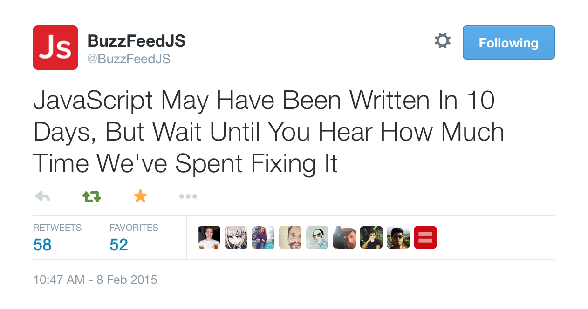

# Using JavaScript from the Future in Your Rails Application Today

Steve Kinney, @stevekinney

---

## Hello

My name is Steve and I am an instructor at the Turing School of Software and Design.

^ Hire our students; come mentor; become a student. We've got something for everyone. Come talk to me after this if you're interested.

---

Before we begin, I'd like to take a moment to thank Ruby Central for inviting me to at their annual Ruby on Rails Conference.

---

## And on that note, let's talk about JavaScript.

---

### As far as programming languages go, JavaScript has a pretty serious creation myth.

---

### ECMAScript 1: 1997

You've go to start somewhere.

### ECMAScript 2: 1998

The second addition contained some basic alignment with some international standards.

---

### ECMAScript 3: 1999

In the third edition of the language specification, we were generously given

* Regular expression
* Exception handling
* Some additional string and numeric enhancements

---

### ECMAScript 4

The fourth edition was supposed to include goodies like:

* Classes
* A module system
* Generators and iterators
* Destructuring assignment

It was ultimately abandoned in 2007.

---

### ECMAScript ~~3.1~~ 5: 2009

Brought us fun things like:

* `"strict mode"`;
* Built-in JSON support
* Function binding
* Array methods like `forEach`, `map`, and `reduce`

This is where we live now.

---

### ECMAScript 6: Coming this Summer

The sixth edition will include goodies like:

* Classes
* A module system
* Generators and iterators
* Destructuring assignment

Sound familar?

---

### ECMAScript ~~6~~ 2015: Coming this Summer

The sixth edition will include goodies like:

* Classes
* A module system
* Generators and iterators
* Destructuring assignment

Sound familar?

---



---

## So, what's in this new fangled language specification?

**Short answer**: a lot of stuff that Rubyists will probably like.

---

## But, first, let's pay our condolences to our old friend/nemesis, `var`.

^ You hoisted, you weren't block scoped, you caused confusion and delay.

---

### In Ruby, what do we get if try to be a hero and do something like this?

```rb
puts x
x = 2
```

^ Kaboom! And, rightfully so.

---

### What about in JavaScript?

```js
console.log(x);
var x = 2;
```

^ This just quietly logs `undefined` and moves along. But if we had asked for `y` it would have blown up. `x` hoisted up to the top of the scope, even if it isn't defined yet. This can be confusing for everyone except for those of use who have Stockholm syndrome with the language.

---

### With `let`, things behave as they would with Ruby.

```js
console.log(x);
let x = 2;
```

---

### Block-scoping, for the win.

```js
if (false) { let x = 2; }

console.log(x); // ReferenceError
```

---

### `var` just acts like blocks don't exist.

```js
for (var i = 0; i < 10; i++) {
  // whatever
}

console.log(i); // 10, gross.
```

---

### `let` keeps things where they belong.

```js
for (let j = 0; j < 10; j++) {
  // whatever
}

console.log(j); // ReferenceError.
```

---

## Let's Play "Who Wants to Be a JavaScript Millionaire?"

---

### Round 0

As a real developer, sometimes, I want to make an array of functions that log out a value between one and five.

---

```js
var commands = [];

for (var i = 0; i < 5; i++) {
  commands.push(function (i) {
    console.log(i);
  });
}

// Later on, we take our collection of functions for a spin.

commands.forEach(function (logger) {
  logger();
});
```

---

### What do we get?

```
5
5
5
5
5
```

That's totally not what I wanted. `var` leaked all over the place and all of my beautiful functions are now referencing the same stupid value.

---

### What if we just made one or two little tweaks.

```js
const commands = [];

for (let i = 0; i < 5; i++) {
  commands.push(function () {
    console.log(i);
  });
}

commands.forEach(function (logger) {
  logger();
});
```

---

### What do we get?

```
1
2
3
4
5
```

Much better.

---

### `const` is an immutable version of `let`

---

### Template Strings

Because nothing makes you question your life and career choices more than string concatentation.

---

#### Hypothetical Situation

You're fetching some posts for your new thought leader blog from an API. It's in JSON, of course. You want to render your musings into the DOM in order to shift some paradigms and whatnot. As you do.

---

You might try something like this.

```js
var musing = {
  title: 'JavaScript: Not So Bad Anymore Says Rails Community',
  datePublished: 'Thursday, April 23, 2015'
  body: 'Lorem ipsum…'
};

$('<article><h2>' + musing.title + '</h2><time>' + musing.datePublished +
  '</time><p>' + musing.body + '</p>').appendTo('#deep-thoughts');
```

---

According to science, there is literally a 1,000% chance that you'll forget a `+` the very first time you write this code.

At this point, you'll go throught the requisite stages of grief:

* Flip the desk on to the floor and light your computer on fire.
* Entertain the idea that you could probably just jam some ERB in there. What's the worst that could happen.
* Question the sanity of the Node community.

---

### Template strings to the rescue!

---

So, what do template strings even do?

* Multiline strings (think `%Q{}` in Ruby).
* String interpolation.
* Custom templating, DSLs, and whatnot.

---

In order to harness the power of template stings, we must embrace the backtick.

```js
let regularString = "Hello"
let templateString = `Hello`
```

They will both result in the same string (that way nothing changes for code written pre-ES6), but we get some extra goodness with template strings.

---

String interpolation is only slightly different than in Ruby, we use `$` instead of `#`.

```js
const four = 4;
console.log(`2 + 2 = ${four}`);
```

---

We can also write expressions in your interpolation. (Say that seventheen times fast.)

```js
console.log(`2 + 2 = ${2 + 2}`);
```

---

Let's try this again, shall we?

```js
$(`<article>
     <h2>${musing.title}</h2>
     <time>${musing.datePublished}</time>
     <p>${musing.body}</p>
   </article>`
).appendTo('#deep-thoughts');
```

---

**String concatenation**: Since U've Been Gone, I Can Breathe for the First Time.

---

## Back to "Who Wants to Be a JavaScript Millionaire?"

---

### Round 1

What does this little tidbit of JavaScript do?

```js
[1,2,3].forEach(function (n) {
  console.log(n);
});
```

---

### Round 2

How about this one?

```js
var doubledNumbers = [1,2,3].map(function (n) {
  n * 2;
});
```

---

The answer:

```js
[undefined, undefined, undefined];
```

---

Unlike Ruby, JavaScript does not support implicit returning.[^1]

[^1]: This isn't totally true.

---

### Round 3

```js
var person = {
  name: 'Steve',
  updateName: function () {
    this.name = 'Wes';
  }
};

person.updateName();
```

What is the value if `person.name`?

---

### Round 4

```js
var person = {
  name: 'Steve',
  updateName: function () {
    somethingAsynchronous(function () {
      this.name = 'Wes';
    });
  }
};

person.updateName();
```

What is the value if `person.name`?

---

### Round 4

`person.name` is still `"Steve"`.

And for extra fun, we accidently created a global variable called `name`, which is equal to `"Wes"`

Whoops.

---

### Round 4 (and a Half)

```js
var person = {
  id: 1,
  name: 'Steve',
  updateName: function (newName) {
    this.name = newName;
  },
  sync: function () {
    $.getJSON(`/api/people/${this.id}`, function (data) {
      this.updateName(data.name);
    });
  }
};
```

Any guesses what's going to happen here?

---

### Ugh.

---

### There are some solutions to this and none of them will make you feel good.

---

We could store the current scope into a variable.

```js
var person = {
  id: 1,
  name: 'Steve',
  updateName: function (newName) {
    this.name = newName;
  },
  sync: function () {
    var self = this;
    $.getJSON(`/api/people/${this.id}`, function (data) {
      self.updateName(data.name);
    });
  }
};
```

---

### Gross.

---

In ES5, we can take a shot at using `Function.prototype.bind` to return an anonymous function with `this` set to the current scope.

```js
var person = {
  // Removed for brevity.
  sync: function () {
    $.getJSON(`/api/people/${this.id}`, function (data) {
      this.updateName(data.name);
    }.bind(this));
  }
};
```

---

### Okay, but not great.

---

### Arrow Functions to the Rescue!

---

Arrow functions are a new syntax that will help us deal with two some of the trauma we just endured.

---

We can declare simple functions in one line.

```js
var add = (a, b) => a + b;
```

This boils down to:

```js
var add = function add(a, b) {
  return a + b;
};
```

---

So, remember this failing example from before?

```js
[1,2,3].map(function (n) {
  n * 2;
}); // returns [undefined, undefined, undefined]
```

---

We can refactor it using an arrow function.

```js
[1,2,3].map( n => n * 2 );
```

We can even omit those parentheses from before if we're only passing in one argument.

Much better; very Ruby; wow.

---

If we need more than one line (or if our function body is more than one statement), then we can use curly braces.

```js
[1,2,3].map( n => {
  return n * 2;
});
```

The gotcha is that we lose the implicit returning. Bummer.

---

### So, what's the point of multi-line arrow functions if I need to `return` stuff? What gives?

---

### We'll there is more to the arrow function then meets the eye.

---

### Arrow functions also lexically binds `this`.

---

Let's refactor this horrid piece of code.

```js
var person = {
  id: 1,
  name: 'Steve',
  updateName: function (newName) {
    this.name = newName;
  },
  sync: function () {
    $.getJSON(`/api/people/${this.id}`, function (data) {
      self.updateName(data.name);
    }.bind(this));
  }
};
```

---

First, we can use an arrow function in that callback, to stop all that nonsense with `this`.

```js
var person = {
  id: 1,
  name: 'Steve',
  updateName: function (newName) {
    this.name = newName;
  },
  sync: function () {
    $.getJSON(`/api/people/${this.id}`, data => {
      self.updateName(data.name);
    });
  }
};
```

---

ES6 also gives use some new syntax for defining methods on an object, because writing `function` all over the place is a little ridiculous.

```js
var person = {
  id: 1,
  name: 'Steve',
  updateName(newName) {
    this.name = newName;
  },
  sync() {
    $.getJSON(`/api/people/${this.id}`, data => {
      self.updateName(data.name);
    });
  }
};
```

---

### Hey, Steve, that new sugar for method definitions is pretty nice. Is there more?

---

### Legend has it that you can apparently write object-oriented JavaScript.

---

### The catch is that JavaScript uses prototypal instead of classical inheritance.

---

### For many programmers, prototypal inheritance is different from what they're used to. And, we all know that if it's different from what we're used to, it must be bad.

---

Traditionally in JavaScript, we'd use a function as a constructor of a new object.

```js
function Person(firstName, lastName) {
  this.firstName = firstName;
  this.lastName = lastName;
}
```
---

```js
function Person(firstName, lastName) {
  // `this` right now is the new object we're constructing
  this.firstName = firstName;
  this.lastName = lastName;
  // implicitly: `return this;`
}

var person = new Person('Ada', 'Lovelace');
```

---

### The `Person` constructor also has a `prototype` property that the constructor will set as the new object's prototype. (Got that?)

---

```js
function Person(firstName, lastName) {
  this.firstName = firstName;
  this.lastName = lastName;
  // Set the new object's prototype to Person.prototype
  // implicitly: `return this;`
}

Person.prototype = {
  fullName() { return `${this.firstName} ${this.lastName}` }
}
```

---

### Round 5

What does the last line of this code return?

```js
function Person(firstName, lastName) {
  this.firstName = firstName;
  this.lastName = lastName;
}

Person.prototype = {
  fullName() { return `${this.firstName} ${this.lastName}` }
}

var person = Person('Ada', 'Lovelace');

console.log(person.fullName());
```

---

### Correct Answer

It throws an error!

```
Cannot set property 'firstName' of undefined
```

Oh, and also, you polluted the global scope when you called `Person` as a function instead of as a constructor.

Bummer.

---

### Some wise, bearded JavaScript sage once said that you could build classical inheritance from prototypal, but not the other way around.

---

### ES6 provides you with a bag of sugar to do just that.

---

Let's see if we can't refactor this.

```js
function Person(firstName, lastName) {
  this.firstName = firstName;
  this.lastName = lastName;
}

Person.prototype = {
  fullName() { return `${this.firstName} ${this.lastName}` }
}
```

---

```js
class Person {
  constructor(firstName, lastName) {
    this.firstName = firstName;
    this.lastName = lastName;
  }

  fullName() {
    return `${this.firstName} ${this.lastName}`
  }
}
```

---

```rb
class Person
  initialize(firstName, lastName)
    @firstName = firstName;
    @lastName = lastName;
  }

  def fullName
    return "#{@firstName} #{@lastName}"
  end
end
```

---

```js
class Person {
  constructor(firstName, lastName) {
    this.firstName = firstName;
    this.lastName = lastName;
  }

  fullName() {
    return `${this.firstName} ${this.lastName}`
  }
}
```

---

### Under the hood, it's pretty much the same code we had before, but a bit clear—and with the added advantage that we can't accidently call it as a function instead of a constructor.

---

### What about inheritance?

---

```js
class Developer extends Person {
  constructor(firstName, lastName, favoriteLanguage) {
    super(firstName, lastName);
    this.favoriteLanguage = favoriteLanguage;
  }

  fullName() {
    return `${super.fullName()}, ${this.favoriteLanguage} Developer`
  }
}
```

---

## One of the Things Ruby got really, really right was its use of syntatic sugar to make writing code productive and fun.

---

## Conversely, one of the biggest hurdles for people learning JavaScript is that you have to memorize a bunch of weird incantations in order to get it behave propery.

---

### Round 6

```js
let logArguments = function () {
  console.log(arguments);
};

logArguments(1,2,3);
```

---

```js
[1, 2, 3]
```

---

### Round 7

```js
let iterateArguments = function () {
  arguments.forEach(argument => console.log(argument));
};

iterateArguments(1,2,3);
```

^ Uncaught TypeError: arguments.forEach is not a function

---

```js
Array.isArray(arguments) === false;
```

---

## As you might expect, we have some hacks for dealing with this.

---

We could "borrow" the `forEach` from the `Array.prototype`.

```js
function iterateArguments() {
  Array.prototype.forEach.call(arguments, argument => {
    console.log(argument);
  });
}

iterateArguments(1,2,3);
```

---

Alternatively, we could "borrow" the `slice` method and turn little Pinnochio here into a real array.

```js
function iterateArguments() {
  var args = Array.prototype.slice.call(arguments);
  args.forEach(argument => {
    console.log(argument);
  });
}
```

^ It works. It's a hack, but it works. And, it's how we all have been going about our lives on the client-side.

---

### ES6 gives a spread operator so we can put this hackery behind us.

---

```js
var iterateArguments = (...args) => {
  args.forEach(argument => console.log(argument));
};

iterateArguments(1,2,3);
```

---

```js
let iterateArguments = (x, ...args) => {
  console.log('x is:', x);
  args.forEach(argument => console.log(argument));
};
```

---

### Like Ruby splats, they work both ways as well.

---

Previously, if we had an array of arguments and we wanted to send them to a function, we had to do some black magic, like this:

```js
iterateArguments.apply(null, [1,2,3]);
```

---

In the future (also known as today), we'll be able to do this.

```js
iterateArguments(...[1,2,3]);
```

^ For Rubyists, it's pretty easy to see why this is useful, we've enjoyed the benefits of the splat operator for years.

---

### Fun fact: JavaScript now supports default arguments.

```js
function increment(base, step) {
  step = step || 1;
  return base + step;
}
```

---

```js
function increment(base, step = 1) {
  return base + step;
}
```

---

### We can also do some funky stuff like destructuring assignment with list matching.

```js
var [a, , b] = [1,2,3];

console.log(a); // 1
console.log(b); // 3
```

---

### It works with objects as well.

```js
var socialMediaUpdate = {
  displayName: 'turingschool',
  postBody: 'Hello @RailsConf!',
  datePosted: 'April 23, 2015',
  // …and like a dillion other properties…
}

let { displayName, postBody } = socialMediaUpdate;
console.log(`${displayName}: ${postBody}`);
```

---

### It also works with default parameters.

```js
var socialMediaUpdate = {
  displayName: 'turingschool',
  datePosted: 'April 23, 2015',
  // …and like a dillion other properties…
}

var { displayName, postBody = 'Hello @RailsConf!' } = socialMediaUpdate;
console.log(`${displayName}: ${postBody}`);
```

---

### Don't like the property names? Change them.

```js
var socialMediaUpdate = {
  displayName: 'turingschool',
  postBody: 'Hello @RailsConf!',
  datePosted: 'April 23, 2015',
  // …and like a dillion other properties…
}

let { displayName: name, postBody: text } = socialMediaUpdate;
console.log(`${name}: ${text}`);
```

---

^ You've probably seen something like this in JavaScript (and if you've been programming in Ruby long enough, you might have seen it there as well).

```js
function introducePerson(options) {
  opts = options || {};
  var name = opts.name;
  var age = opts.age;

  return `Hello, my name is ${name} and I am ${age} years old.`;
}
```

---

^ Going forward, you'll be able to cherry pick just the properties you want and then have them automatically assigned to local variables inside of the function.

```js
function introducePerson({ name, age }) {
  return `Hello, my name is ${name} and I am ${age} years old.`
}
```

---

In what should come as no surprise, you can use have some arguments that come before it.

---

### Fixing JavaScript, one small feature at a time.

---

## We need to have a talk about managing dependencies in JavaScript.

---

JavaScript dependency management at its best.

```html
<script src="jquery.min.js"></script>
<script src="jquery-ui.min.js"></script>
<script src="underscore.min.js"></script>
<script src="backbone.min.js"></script>
<script src="bootstrap.min.js"></script>
<script src="d3.min.js"></script>
```

Right up there with CSS.

---

### Anytime you fill inclined to speak ill of the Asset Pipeline, I want you to just take a moment and think about the previous slide.

---

### Has to be a better way, right?

---

### Don't worry, ES6 ships with modules.

---

### They work a little differently than Ruby's `require`, however.

^ In Ruby, when we require a file, we pull all of the classes, constants, and modules into the global scope. With JavaScript modules, we have to be specific about what we want to let out of a module, and what functionality we want to import when we load the module—everything else is wrapped in a closure.

---

### Export a thing.

In `lib/super-high-level-math.js`:

```js
export function sum(..addends) {
  return addends.reduce( (sum, add) => sum + add );
}
```

---

### Import a thing.

In `app.js`:

```js
import { sum } from 'lib/super-high-level-math';

sum(2, 2); // returns 4, shockingly
```

---

### Export some things.

```js
export function sum(..addends) {
  return addends.reduce( (sum, add) => sum + add );
}

export function square(n) {
  return n * n;
}
```

---

### Import some things.

```js
import { sum, square } from 'lib/super-high-level-math';

sum(2, 2); // returns 4, shockingly
square(2); // also 4, amazingly
```

---

### Import all the things.

```js
import * as mathyMath from 'lib/super-high-level-math';

mathyMath.sum(2, 2); // returns 4, shockingly
mathyMath.square(2); // also 4, amazingly
```

---

### Export the default thing.

```js
export default function (x) {
  return x + 2;
}
```

---

### Import the default thing.

```js
import addTwo from 'lib/addtion-is-awesome.js'

addTwo(2); // Can you even believe this returns 4?
```
